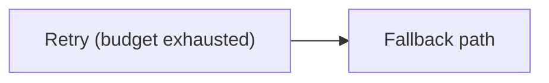

# Mermaid authoring standard

This file defines the default authoring contract for Mermaid in Markdown. The goal is not to use every Mermaid feature. The goal is to produce diagrams that parse reliably and stay legible in common renderers.

## The authoring rule

Model the question first, then write the smallest Mermaid that answers it.

Every diagram should be able to complete this sentence:

> "After reading this diagram, the reader should be able to predict ..."

If you cannot finish that sentence precisely, do not start drawing yet.

## Portable syntax defaults

Use these defaults unless there is a strong reason not to:

- Prefer plain declarations such as `flowchart LR`, `sequenceDiagram`, `stateDiagram-v2`, `classDiagram`, `erDiagram`, and `timeline`.
- Prefer one top-level `direction` only when the type supports it and the direction materially improves readability.
- Prefer explicit node IDs in `flowchart` and readable actor names in `sequenceDiagram`.
- Prefer quoted labels whenever punctuation could be mistaken for syntax.
- Prefer simple edge labels and only when the edge meaning would otherwise be ambiguous.

## Parser-safe rules

These are the practical rules most likely to prevent broken Markdown Mermaid.

### Quote risky text

Wrap labels in double quotes when they contain characters that can confuse the parser, especially parentheses or syntax-looking punctuation.

Safe example:

### Treat `end` as risky text

In flowcharts and sequence diagrams, the word `end` can break parsing when used as plain text. Quote it if it must appear in a label.

### Do not imitate directives in comments

Avoid comments that look like directive syntax. In `%%` comments, do not introduce brace patterns that resemble Mermaid directives.

### Use markdown strings only when needed

Mermaid supports markdown strings and wrapping, but portability is better when labels stay plain and short. Reach for markdown-formatted labels only when emphasis materially helps comprehension.

### Use subgraphs sparingly

`subgraph` is valid and useful, but it creates visual weight quickly. Prefer it for clear ownership or stage grouping, not as a reflex. Avoid more than one nesting level.

### Use subgraph direction only to rescue readability

If the whole diagram already has a clear direction, do not override subgraph directions unless the local geometry becomes confusing.

## Layout discipline

Layout problems are usually modeling problems in disguise.

### One diagram, one job

Do not show temporal order and static ownership in the same picture unless one is clearly secondary and still readable. Split them instead.

### Choose direction from the reading motion

- Use `LR` for pipelines, request paths, and left-to-right causal stories.
- Use `TB` for decision trees, progressive expansion, and vertically stacked lifecycles.
- Use `RL` or `BT` only when there is a strong narrative reason.

### Keep the node budget tight

- Ideal: 6-10 nodes
- Soft ceiling: 12 nodes
- Above 12: split unless the structure is still obvious at a glance

### Keep labels compact

Prefer noun phrases and short verbs:

- Good: `Prompt Cache`
- Good: `Provider Reply`
- Bad: `The provider returns a partially streamed tool-call response`

If a label wants a full sentence, move the explanation into prose or a note.

## Low-portability features

Avoid these unless the renderer is known and the user explicitly benefits from them:

- HTML labels
- interactive features such as `click`
- icon syntax
- heavy theme customization blocks
- multi-layer custom styling on nodes and links
- clever formatting that exists mainly for visual flourish

## Failure signatures

If a diagram feels wrong, it is usually one of these:

- Too many edge labels
- Too many subgraphs
- Mixed jobs in one diagram
- A sentence stuffed into every node
- Direction chosen by habit instead of the reader's eye path

The fix is usually deletion, not decoration.
