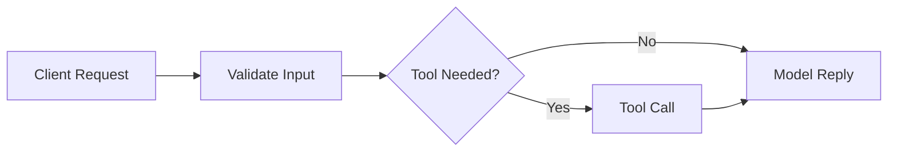
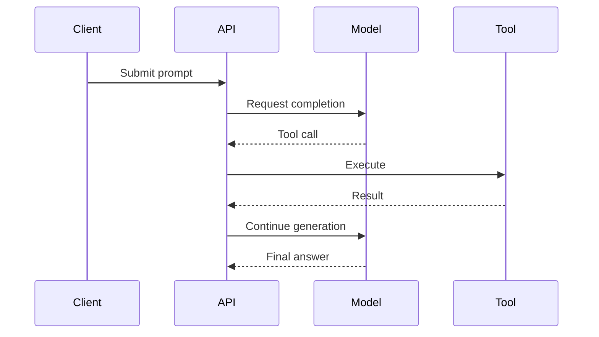

# Mermaid pattern cookbook

Use this file after the diagram type is already chosen. These are compact defaults, not rigid templates.

## `flowchart`

Use for branching pipelines, staged routing, or decision flow.

Defaults:

- Prefer `LR` for pipelines and `TB` for decision trees.
- Keep the number of decisions low; a decision-heavy chart usually wants to be split.
- Use subgraphs only for stage grouping or ownership boundaries.

Good fit:

## `sequenceDiagram`

Use for actor interaction over time.

Defaults:

- Prefer 3-5 actors.
- Prefer 1 main path plus at most 1 `alt` or `opt` block unless the comparison itself is the point.
- Notes are allowed, but only when they discharge a subtle boundary.

Good fit:

## `stateDiagram-v2`

Use when one object or workflow changes state over time.

Defaults:

- Keep state names short.
- Show only meaningful transitions.
- Prefer this over `flowchart` when the same thing revisits states.

## `classDiagram`

Use for static type, interface, or component relationships.

Defaults:

- Prefer one clear dependency surface.
- Keep method lists short; the diagram should show architecture, not copy source code.
- Use `direction` if the default layout hides the primary dependency story.

## `erDiagram`

Use for entity shape and cardinality.

Defaults:

- Keep attributes selective.
- Show only entities relevant to the argument.
- Prefer this over `classDiagram` when persistence structure is the point.

## `timeline`

Use for release progression, deprecations, migrations, or incident chronology.

Defaults:

- Prefer sparse milestones over diary-like detail.
- Group related change under each date or version.
- Use prose for commentary; use the timeline for ordering.

## Split heuristics

Split one diagram into two when any of these happen:

- The same reader question cannot explain the whole diagram.
- The diagram needs both static structure and runtime chronology.
- The labels have become mini-paragraphs.
- The branches exist only because unrelated concerns were forced together.
